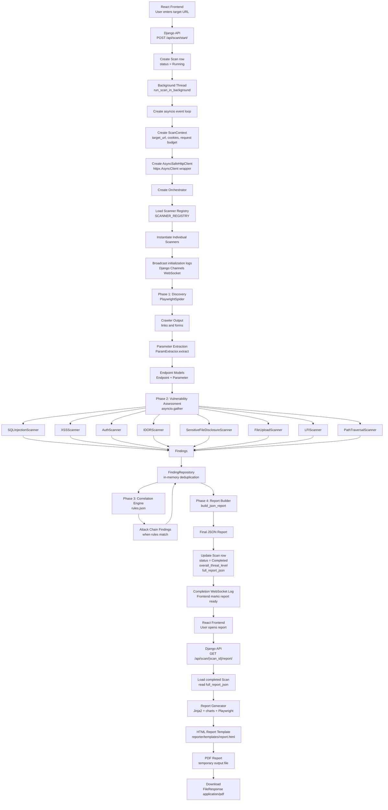

# Backend Pipeline Diagram

This diagram represents the complete current execution flow from starting a scan in the React frontend to downloading the generated report. It focuses on the backend pipeline and the order in which the major scan components run.

Related documentation: [Architecture](../architecture.md), [API](../api.md), [Testing](../testing.md), [Diagram Index](README.md).

Interpretation: the pipeline is sequential at the phase level but asynchronous inside the scanner execution phase. The crawler runs first, endpoint extraction prepares scanner input, all registered scanners run concurrently, findings are correlated, the JSON report is stored, and the PDF is generated only when the report download endpoint is requested.
