# Class Diagram

This diagram shows the main classes and dataclasses used by the current backend implementation. It focuses on the Django API layer, scan orchestration, core scanner abstractions, scanner implementations, internal engine models, correlation, and report building.

Related documentation: [Architecture](../architecture.md), [API](../api.md), [Testing](../testing.md), [Diagram Index](README.md).

```mermaid
classDiagram
    class Scan {
        +UUID id
        +URLField target_url
        +CharField status
        +CharField overall_threat_level
        +DateTime start_time
        +DateTime end_time
        +JSONField full_report_json
    }

    class ScanFinding {
        +Scan scan
        +str vulnerability_id
        +str title
        +str risk_level
        +str affected_path
        +JSONField details
        +DateTime created_at
    }

    class StartScanView {
        +post(request) Response
    }

    class DownloadReportView {
        +get(request, scan_id) FileResponse
    }

    class ScanProgressConsumer {
        +connect()
        +disconnect(close_code)
        +scan_telemetry(event)
    }

    class ScanContext {
        +str target_url
        +dict cookies
        +dict headers
        +int max_requests
        +int max_scan_time_sec
        +int request_count
        +float start_time
        +bool is_aborted
        +consume_budget() bool
        +should_fuzz(url) bool
    }

    class AsyncSafeHttpClient {
        +int timeout
        +Semaphore semaphore
        +float delay
        +ScanContext context
        +bool allow_local
        +request(method, url, kwargs) HttpResponse
        +close()
    }

    class Orchestrator {
        +str scan_id
        +ScanContext context
        +AsyncSafeHttpClient client
        +datetime start_time
        +list scanners
        +FindingRepository repository
        +send_live_log(message_text)
        +register_scanner(scanner_instance)
        +load_scanners()
        +run_assessment() dict
    }

    class PlaywrightSpider {
        +str target_url
        +str domain
        +dict cookies
        +set discovered_urls
        +list discovered_forms
        +crawl(max_pages) dict
    }

    class ParamExtractor {
        +extract(crawl_data) List~Endpoint~
    }

    class BaseScanner {
        <<abstract>>
        +str target_url
        +AsyncSafeHttpClient client
        +callable log_callback
        +execute(endpoints) List~Finding~
        +run_scan(endpoints) List~Finding~
    }

    class SQLInjectionScanner {
        +run_scan(endpoints) List~Finding~
    }

    class XSSScanner {
        +run_scan(endpoints) List~Finding~
        -_build_finding(xss_type, param, payload, ep_url, request_line) Finding
    }

    class AuthScanner {
        +run_scan(endpoints) List~Finding~
    }

    class IDORScanner {
        +run_scan(endpoints) List~Finding~
        -_test_restful_paths(ep, cases) Finding
        -_test_parameters(ep, cases) Finding
        -_analyze_variance(url, baseline_text, exploit_text, regex_pattern) tuple
        -_build_finding(ep, exploit_url, vector_type, payload, regex_pattern, match_preview) Finding
    }

    class SensitiveFileDisclosureScanner {
        +run_scan(endpoints) List~Finding~
    }

    class FileUploadScanner {
        +run_scan(endpoints) List~Finding~
        -_is_upload_endpoint(ep, upload_keywords) bool
    }

    class LFIScanner {
        +run_scan(endpoints) List~Finding~
    }

    class PathTraversalScanner {
        +run_scan(endpoints) List~Finding~
    }

    class PayloadManager {
        +dict FAMILY_MAP
        +dict _payloads
        +bool _is_loaded
        +load_payloads()
        +get_payloads(vulnerability_type) dict
        -_pre_compile_signatures(data)
    }

    class ResponseAnalyzer {
        +is_boolean_variance(baseline, true_resp, false_resp, true_payload, false_payload) bool
        +get_xss_context(response_text, payload) dict
        +has_new_signature(baseline_text, response_text, compiled_regex)
        +analyze_session_flags(set_cookie_header, required_flags) list
        +is_auth_successful(status_code, headers, body) bool
    }

    class FindingRepository {
        +list _findings
        +save(finding)
        +save_all(findings)
        +get_all() List~Finding~
        +clear()
    }

    class CorrelationEngine {
        +FindingRepository repository
        +callable log_callback
        +dict rules
        +run_correlation()
        -_load_rules() dict
    }

    class ReportBuilder {
        +build_json_report(scan_id, target_url, findings, start_time) dict
        -_finding_to_dict(finding, idx) dict
    }

    class Parameter {
        +str name
        +str value
        +str param_type
    }

    class Endpoint {
        +str url
        +str method
        +List~Parameter~ params
        +dict headers
        +dict body
        +str original_query
        +List~str~ file_inputs
        +str source
        +str type
    }

    class Evidence {
        +str type
        +str request
        +str response
        +str screenshot_base64
    }

    class ProofOfConcept {
        +str intro_text
        +List~str~ steps_to_reproduce
        +Evidence evidence
    }

    class Finding {
        +str title
        +str owasp_category
        +str threat_level
        +str cvss_score
        +str affected_path
        +str description
        +str business_impact
        +List~str~ recommendations
        +List~str~ references
        +ProofOfConcept proof_of_concept
        +str status
        +str id
        +str timestamp
        +to_dict() dict
    }

    class HttpResponse {
        +bool success
        +int status_code
        +str text
        +dict headers
        +str error_message
        +float elapsed_time
        +size int
    }

    Scan "1" --> "*" ScanFinding
    StartScanView ..> Scan
    StartScanView ..> Orchestrator
    DownloadReportView ..> Scan
    DownloadReportView ..> ReportBuilder
    ScanProgressConsumer ..> Orchestrator

    Orchestrator *-- FindingRepository
    Orchestrator --> ScanContext
    Orchestrator --> AsyncSafeHttpClient
    Orchestrator --> PlaywrightSpider
    Orchestrator ..> ParamExtractor
    Orchestrator ..> CorrelationEngine
    Orchestrator ..> ReportBuilder
    Orchestrator o-- BaseScanner

    AsyncSafeHttpClient --> ScanContext
    AsyncSafeHttpClient ..> HttpResponse
    PlaywrightSpider ..> Endpoint
    ParamExtractor ..> Endpoint
    Endpoint *-- Parameter

    BaseScanner <|-- SQLInjectionScanner
    BaseScanner <|-- XSSScanner
    BaseScanner <|-- AuthScanner
    BaseScanner <|-- IDORScanner
    BaseScanner <|-- SensitiveFileDisclosureScanner
    BaseScanner <|-- FileUploadScanner
    BaseScanner <|-- LFIScanner
    BaseScanner <|-- PathTraversalScanner

    BaseScanner ..> Endpoint
    BaseScanner ..> Finding
    SQLInjectionScanner ..> PayloadManager
    SQLInjectionScanner ..> ResponseAnalyzer
    XSSScanner ..> PayloadManager
    XSSScanner ..> ResponseAnalyzer
    AuthScanner ..> PayloadManager
    IDORScanner ..> PayloadManager
    SensitiveFileDisclosureScanner ..> PayloadManager
    SensitiveFileDisclosureScanner ..> ResponseAnalyzer
    FileUploadScanner ..> PayloadManager
    FileUploadScanner ..> ResponseAnalyzer
    LFIScanner ..> PayloadManager
    LFIScanner ..> ResponseAnalyzer
    PathTraversalScanner ..> PayloadManager
    PathTraversalScanner ..> ResponseAnalyzer

    Finding *-- ProofOfConcept
    ProofOfConcept *-- Evidence
    FindingRepository o-- Finding
    CorrelationEngine --> FindingRepository
    CorrelationEngine ..> Finding
    ReportBuilder ..> Finding
```

Interpretation: inheritance arrows show concrete scanner classes extending `BaseScanner`. Composition arrows show objects owned during execution, such as the orchestrator owning a finding repository and using scanner instances. Dependency arrows show classes that call or consume another class without owning it permanently.
