# Component Diagram

This diagram shows the current backend package organization and how major components depend on each other during a scan.

Related documentation: [Architecture](../architecture.md), [API](../api.md), [Testing](../testing.md), [Diagram Index](README.md).

```mermaid
flowchart TB
    Frontend["frontend/nexusflow<br/>React UI"]
    VulnerableApp["vulnerable_app<br/>Local Flask Target"]

    subgraph Backend["backend"]
        subgraph Config["config"]
            Settings["settings.py<br/>Django settings"]
            URLs["urls.py<br/>Root API routing"]
            ASGI["asgi.py<br/>HTTP/WebSocket protocol routing"]
        end

        subgraph API["api"]
            Views["views.py<br/>StartScanView<br/>DownloadReportView"]
            Models["models.py<br/>Scan<br/>ScanFinding"]
            Consumers["consumers.py<br/>ScanProgressConsumer"]
            ApiURLs["urls.py<br/>HTTP routes"]
            Routing["routing.py<br/>WebSocket routes"]
        end

        subgraph Engine["engine"]
            Orchestrator["orchestrator.py<br/>Pipeline coordinator"]

            subgraph Core["core"]
                ScanContext["scan_context.py"]
                HttpClient["http_client.py<br/>AsyncSafeHttpClient"]
                BaseScanner["base_scanner.py"]
            end

            subgraph Crawler["crawler"]
                Spider["spider.py<br/>PlaywrightSpider"]
            end

            subgraph Extractor["extractor"]
                ParamExtractor["param_extractor.py"]
            end

            subgraph EngineModels["models"]
                EndpointModel["endpoint.py"]
                FindingModel["finding.py"]
                HttpContext["http_context.py"]
            end

            subgraph Registry["registry"]
                ScannerRegistry["scanner_registry.py"]
            end

            subgraph Payloads["payloads"]
                PayloadManager["payload_manager.py"]
                PayloadDefinitions["definitions/*.json"]
            end

            subgraph Analyzer["analyzer"]
                ResponseAnalyzer["response_analyzer.py"]
                FingerprintAnalyzer["fingerprint.py"]
            end

            subgraph Scanners["scanners"]
                Injection["injection<br/>SQLi, XSS"]
                Authentication["authentication<br/>AuthScanner + checks"]
                Authorization["authorization<br/>IDOR"]
                FileSecurity["file_security<br/>SFD, upload, LFI, traversal"]
            end

            subgraph Storage["storage"]
                FindingRepository["finding_repository.py"]
            end

            subgraph Correlation["correlation"]
                ChainEngine["chain_engine.py"]
                Rules["rules.json"]
            end
        end

        subgraph Reporter["reporter"]
            ReportBuilder["report_builder.py"]
            ReportGenerator["report_generator.py"]
            Template["templates/report.html"]
            StaticContent["static_content.json"]
            Charts["charts/*.py"]
        end

        SQLite["db.sqlite3<br/>Local SQLite database"]
    end

    Frontend -->|POST /api/scan/start| Views
    Frontend -->|GET report PDF| Views
    Frontend <-->|WebSocket telemetry| Consumers

    URLs --> ApiURLs
    ASGI --> Routing
    ApiURLs --> Views
    Routing --> Consumers
    Views --> Models
    Models --> SQLite

    Views --> Orchestrator
    Orchestrator --> ScanContext
    Orchestrator --> HttpClient
    Orchestrator --> Spider
    Orchestrator --> ParamExtractor
    Orchestrator --> ScannerRegistry
    Orchestrator --> FindingRepository
    Orchestrator --> ChainEngine
    Orchestrator --> ReportBuilder
    Orchestrator --> Consumers

    Spider --> VulnerableApp
    ParamExtractor --> EndpointModel

    ScannerRegistry --> Injection
    ScannerRegistry --> Authentication
    ScannerRegistry --> Authorization
    ScannerRegistry --> FileSecurity

    Injection --> BaseScanner
    Authentication --> BaseScanner
    Authorization --> BaseScanner
    FileSecurity --> BaseScanner

    Injection --> PayloadManager
    Authentication --> PayloadManager
    Authorization --> PayloadManager
    FileSecurity --> PayloadManager
    PayloadManager --> PayloadDefinitions

    Injection --> ResponseAnalyzer
    Authentication --> ResponseAnalyzer
    Authorization --> ResponseAnalyzer
    FileSecurity --> ResponseAnalyzer

    HttpClient --> VulnerableApp
    FindingRepository --> FindingModel
    ChainEngine --> FindingRepository
    ChainEngine --> Rules
    ReportBuilder --> FindingModel

    Views --> ReportGenerator
    ReportGenerator --> Template
    ReportGenerator --> StaticContent
    ReportGenerator --> Charts
    ReportGenerator -->|renders PDF with Playwright| Views
```

Interpretation: packages are grouped by their real directory names. Arrows show runtime dependencies, such as the orchestrator using crawler, extractor, scanner registry, finding repository, correlation, and report builder. The frontend talks only to the backend API and WebSocket layer, while scanners and the crawler interact with the local vulnerable application.
