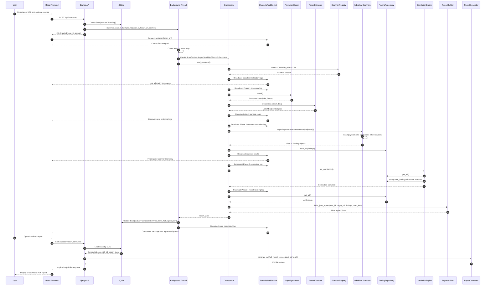

# Sequence Diagram

This diagram follows the current scan lifecycle from the frontend starting a scan, through backend execution, live WebSocket telemetry, report storage, and PDF download.

Related documentation: [Architecture](../architecture.md), [API](../api.md), [Testing](../testing.md), [Diagram Index](README.md).

Interpretation: the scan starts through HTTP, continues in a background thread, and sends live messages through WebSockets. The PDF is not returned when the scan starts; it is generated later when the report endpoint is requested for a completed scan.
